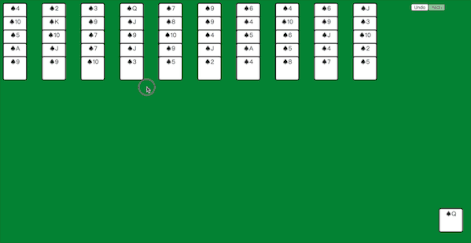

# Spider Card

## Usage

```
git clone https://github.com/h1bomb/spider-card.git
cd spider-card
# you can install yarn or npm
yarn 
yarn start
# or
yarn build
# deploy to somewhere

```

## Shotsnap


## Feature

### Base Logic
* Generate cards
* Move cards
* Dispatch cards to Lists
* Full cards clear together
* Selected Card show other style
* Add undo and redo 
* New game,default desk show
* Step Number Show[todo]
* Four type card [todo]
* Flip card [todo]

### Better Code
* Use redux rebuild this game
* Use immer
* Use Now deploy

### UI / UX
* Change to Better UI
* Add drag and drop 
* Dispatch Cards Animation
* Win need confetti effect
* Move Cards Animation[todo]
* Clear Cards Animation[todo]

